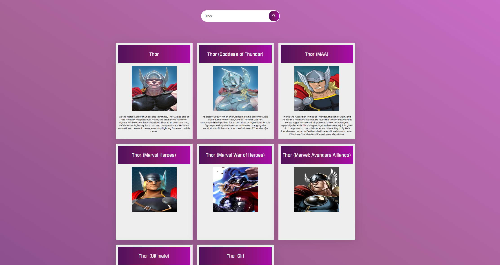

# MarvelHeroes: Marvel API Search Engine
**MarvelHeroes** is a react application that allows the user to search for their favourite marvel characters. 

## Installation
```bash
npm install
npm start
```
## Screenshots



## What I Learned
* Reading and applying API documentation instructions [(Marvel API)](https://developer.marvel.com)
.
* Integrating Axios with React.

## License
MIT

